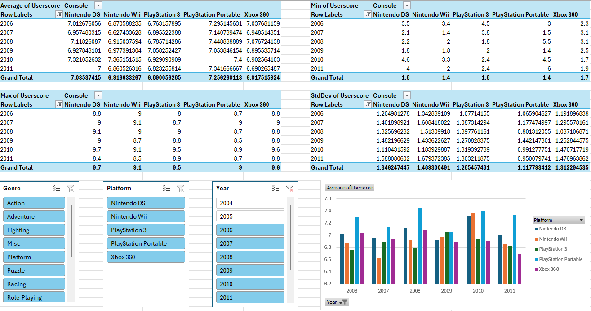

# Video Game Sales and Reviews in the Seventh Generation

## Table of Contents 

* [Defining the question](#defining_the_question)
* [Collecting Data](#collecting-data)
* [Cleaning the Data](#cleaning-data)
* [Analysing the Data](#analysing-data)
* [Visualising and sharing my findings](#visualising-data)
* [Insights gained](#insights-gained)

This personal portfolio project was based around datasets on video game sales and video game reviews found in Kaggle. 

Due to the limited data available of one of the datasets, I decided to limit the scope of the analysis to the seventh generation of video game consoles and only in the years 2006-2011 as these were the years when all the consoles had released and none had been discontinued.

After collecting the data, cleaning and pre-processing it and then performing the actual data analysis, I found the trends and patterns in the video game reviews and sales within this time period.

The PowerPoint presentation for this project can be found and downloaded from this repository or through [here](https://drive.google.com/drive/folders/1y96eM2wnCzS5DHfC17z4AD9_uWC3nqp3?usp=sharing).

## Defining the Question 

Are the sales of video games linked to the reviews they get?

[Back to Table of Contents](#table-of-contents)

## Collecting Data 

In order to answer this question, I had to find datasets for both video game reviews and video game sales. I first looked for data regarding video game reviews and found a  dataset for video game reviews taken from the site Metacritic, which aggregates video game review scores from different sites. The dataset I used for video game reviews can be found [here](https://www.kaggle.com/datasets/henrylin03/metacritic-games-user-reviews-and-metascores).

Afterwards, I looked around for data regarding video game sales and found a dataset for video game sales taken from the site VGChartz, which collect video game sales data from different territories such as North America, Europe, Japan and also consolidates them to estimate the global sales data of a video game. The dataset I used for video game sales can be found [here](https://www.kaggle.com/datasets/thedevastator/global-video-game-sales).

[Back to Table of Contents](#table-of-contents)

## Cleaning the Data 

After collecting the data, I had to clean and pre-process it to be fit for analysis purposes. To start off with, I decided to remove rows where there was no matching reviews data or sales data.

Alongside this, I removed duplicates and made sure to add conditional formatting to each column in order to remove erroneous values.

I also decided to discard columns that I decided were not necessary such as ranking of the video games based on sales (found in the initial video game sales dataset). For some columns such as platform, the values were homogenised to include the full name of the consoles rather than acronyms or other shortened forms.

All of this was performed through the PowerQuery editor in Excel.

[Back to Table of Contents](#table-of-contents)

## Analysing the Data 

After cleaning and pre-processing the data, I used Pivot Tables to calculate, summarise and analyse the data to make comparisons and spot patterns and trends in the data. 

I decided to create PivotTables with a focus on either the user/critic scores for each video game in the dataset or the sales for each video game in the dataset.

### The user scores PivotTable:

### The critic scores PivotTable:

### Finally, the sales PivotTable:

[Back to Table of Contents](#table-of-contents)

## Visualising and sharing my findings 

Finally, I decided to create a PowerBI dashboard to visualise and share my findings from the data. In creating the PowerBI dashboard, I am able to display the data in a format that even non-data savvy users can read and interact with.

Inside of the dashboard itself, I created a contents page that linked to three different sections for: user review scores, critic review scores and finally sales.

### The contents page:

### The user scores section:

### The critic scores section:

### Finally, the sales section:

[Back to Table of Contents](#table-of-contents)

## Insights gained 

The Nintendo Wii had the best sales of video games throughout the seventh generation of video game consoles, having the most game sales in 4 out of 6 years in the studied timespan.

The PlayStation Portable had the best-rated video games for users throughout the seventh generation of video game consoles, having the highest average user scores of its video game selection in 4 out of 6 years in the studied timespan.

Finally, the PlayStation 3 had the best-rated video games for critics throughout the seventh generation of video game consoles, having the highest average critic scores of its video game selection in all 6 years in the studied timespan.

PlayStation console games seemed to get the most favourable review scores, both for users and critics.

There seemed to be no correlation between video game sales and reviews as whilst the Nintendo Wii had the lowest average critic scores of its video game selection in all 6 years in the studied timespan, it had the best sales of video games in this same timespan.

[Back to Table of Contents](#table-of-contents)

